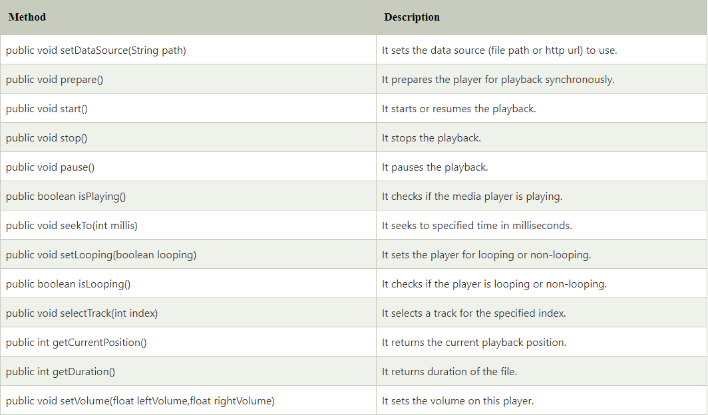

Media Player
https://www.javatpoint.com/kotlin-android-media-player
https://developer.android.com/guide/topics/media/mediaplayer
<h1>Media Player</h1>
<h2>Introduction</h2>
Media is a class that is used to control the playback of audio/vedio files and streams.

The android.media.MediaPlayer class is usd to control the audio or video files. It access the build-in media player services such as playing audio, video, etc. To use the MediaPlayer class, we have to call the create the instance of it by calling create() method of this class.

<div>
<h3>Methods of MediaPlayer class</h3>
<div>There are examples of MediaPlayer method:</div>

</div>

<h3>Using MediaPlayer</h3>
One of the most important components of the media framework is the MediaPlayer class. An object of this class can fetch, decode, and play both audio and video with minimal setup. It supports several different media sources such as:
<h4>1. Local resources</h4>
<h4>2. Internal URIs, such as one you might obtain from a Content Resolver</h4>
<h4>3. External URLs (streaming)</h4>
For a list of media formats that Android supports, see the Supported Media Formats page.

<h3>Example of Android MediaPlayer with SeekBar</h3>
In this example, we will create a Media Player with playback control functionality such as play, pause, and stop. We also integrate the SeekBar to show the progress level of the media player.
```xml
...
<?xml version="1.0" encoding="utf-8"?>  
<android.support.constraint.ConstraintLayout xmlns:android="http://schemas.android.com/apk/res/android"  
    xmlns:app="http://schemas.android.com/apk/res-auto"  
    xmlns:tools="http://schemas.android.com/tools"  
    android:layout_width="match_parent"  
    android:layout_height="match_parent"  
    tools:context="example.javatpoint.com.kotlinmediaplayer.MainActivity">  
  
    <Button  
        android:id="@+id/pauseBtn"  
        android:layout_width="wrap_content"  
        android:layout_height="wrap_content"  
        android:layout_marginBottom="8dp"  
        android:layout_marginEnd="8dp"  
        android:layout_marginStart="8dp"  
        android:layout_marginTop="8dp"  
        android:enabled="false"  
        android:text="Pause"  
        app:layout_constraintBottom_toBottomOf="parent"  
        app:layout_constraintEnd_toStartOf="@+id/playBtn"  
        app:layout_constraintStart_toStartOf="parent"  
        app:layout_constraintTop_toTopOf="parent" />  
  
    <Button  
        android:id="@+id/playBtn"  
        android:layout_width="88dp"  
        android:layout_height="wrap_content"  
        android:layout_marginBottom="8dp"  
        android:layout_marginEnd="8dp"  
        android:layout_marginStart="8dp"  
        android:layout_marginTop="8dp"  
        android:text="Play"  
        app:layout_constraintBottom_toBottomOf="parent"  
        app:layout_constraintEnd_toStartOf="@+id/stopBtn"  
        app:layout_constraintStart_toEndOf="@+id/pauseBtn"  
        app:layout_constraintTop_toTopOf="parent" />  
  
    <Button  
        android:id="@+id/stopBtn"  
        android:layout_width="wrap_content"  
        android:layout_height="wrap_content"  
        android:layout_marginBottom="8dp"  
        android:layout_marginEnd="24dp"  
        android:layout_marginRight="24dp"  
        android:layout_marginTop="8dp"  
        android:enabled="false"  
        android:text="Stop"  
        app:layout_constraintBottom_toBottomOf="parent"  
        app:layout_constraintEnd_toEndOf="parent"  
        app:layout_constraintTop_toTopOf="parent" />  
  
    <RelativeLayout  
        android:layout_width="368dp"  
        android:layout_height="wrap_content"  
        android:layout_marginEnd="8dp"  
        android:layout_marginStart="8dp"  
        android:layout_marginTop="76dp"  
        app:layout_constraintEnd_toEndOf="parent"  
        app:layout_constraintHorizontal_bias="1.0"  
        app:layout_constraintStart_toStartOf="parent"  
        app:layout_constraintTop_toTopOf="parent">  
  
        <TextView  
            android:id="@+id/tv_pass"  
            android:layout_width="wrap_content"  
            android:layout_height="wrap_content" />  
  
        <TextView  
            android:id="@+id/tv_due"  
            android:layout_width="wrap_content"  
            android:layout_height="wrap_content"  
            android:layout_alignParentEnd="true"  
            android:layout_alignParentRight="true" />  
  
        <SeekBar  
            android:id="@+id/seek_bar"  
            android:layout_width="match_parent"  
            android:layout_height="wrap_content"  
            android:layout_below="@id/tv_pass"  
            android:saveEnabled="false" />  
    </RelativeLayout>  
</android.support.constraint.ConstraintLayout>  
...
```