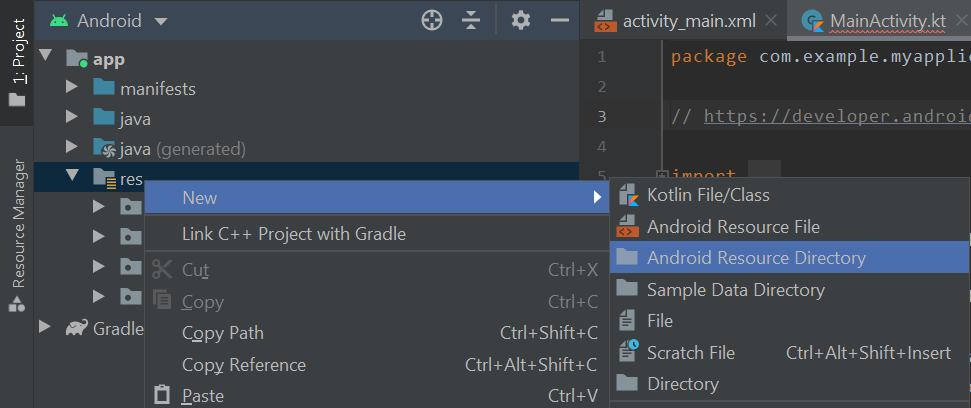
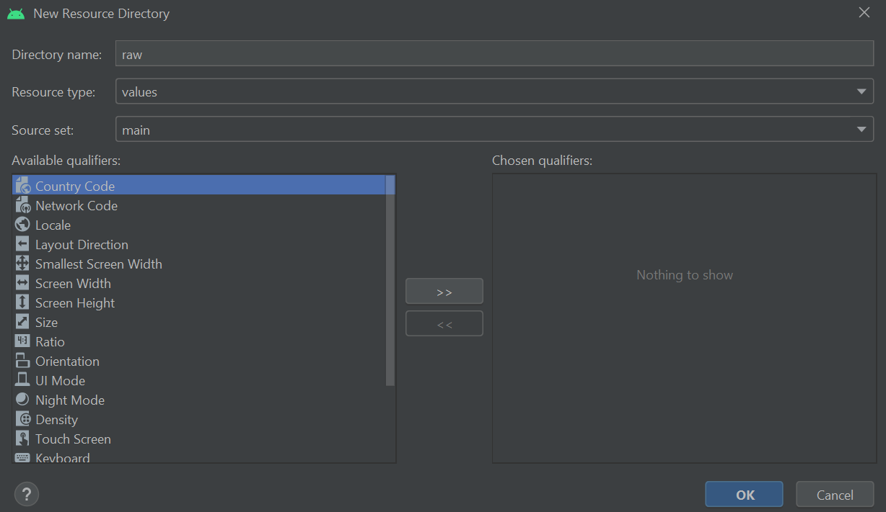
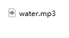
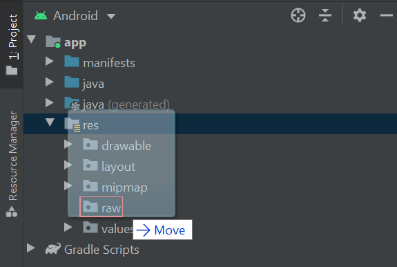
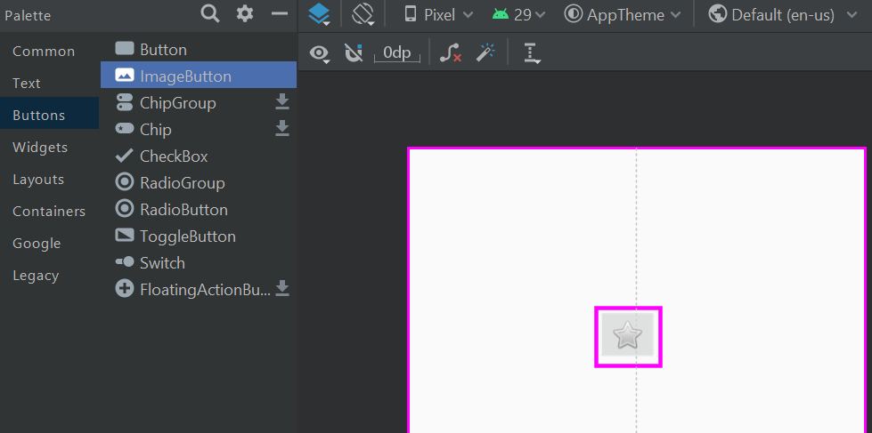
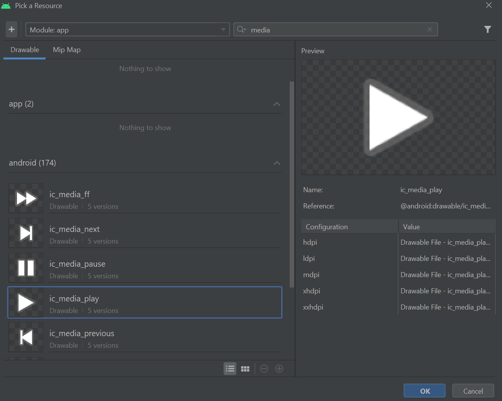
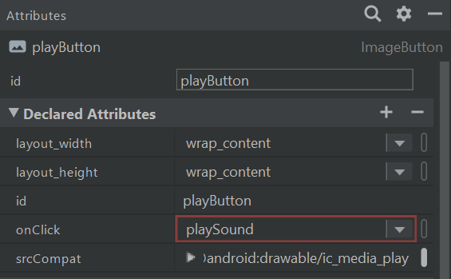
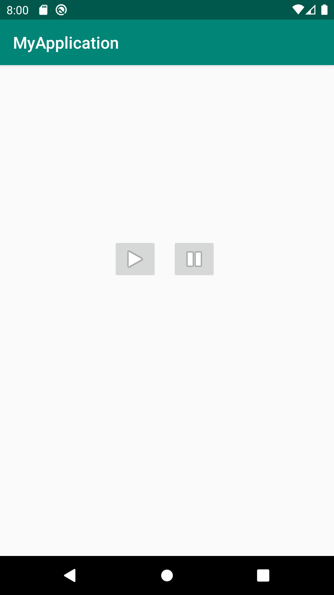

# **Media Player**
## Overview
The Android multimedia framework includes support for playing variety of common media types, so that you can easily integrate audio, video and images into your applications. You can play audio or video from media files stored in your application's resources (raw resources), from standalone files in the filesystem, or from a data stream arriving over a network connection, all using MediaPlayer APIs.

## Methods of MediaPlayer class
Media is a class that is used to control the playback of audio/vedio files and streams.

The android.media.MediaPlayer class is usd to control the audio or video files. It access the build-in media player services such as playing audio, video, etc. To use the MediaPlayer class, we have to call the create the instance of it by calling `create()` method of this class.
<div>There are examples of MediaPlayer method:</div>

</div>

## Using MediaPlayer
One of the most important components of the media framework is the MediaPlayer class. An object of this class can fetch, decode, and play both audio and video with minimal setup. It supports several different media sources such as:
<h4>1. Local resources.</h4>
<h4>2. Internal URIs, such as one you might obtain from a Content Resolver.</h4>
<h4>3. External URLs (streaming).</h4>
For a list of media formats that Android supports, see the Supported Media Formats page.

## Importing audio files
Sound effects and music that will be used in the app first must be imported into the Android Studio project. To do this, navigate through **Project > app then right-click the res folder**. **Select New > Android Resource Directory**


Set the Directory name to **'raw'** then press OK.


This will create a folder called raw, which is where you will store media files. For this tutorial, we will use an MP3 recording of running water (which you can download below) but you are welcome to use another audio file of your choosing.


Drag and drop the audio file from your computer into the raw folder. Note, you may also be asked to confirm that you wish to move the audio file over to the project.


The water.mp3 file is now ready to be used.

## Adding the play and pause buttons
In this section, we will add the play and pause buttons which will control playback. Open up the layout file where you want the buttons to go such as activity_main.xml (found by navigating through **Project > app > res > layout**). Open the file in Design view and locate the Palette. Search in the Buttons category for the ImageButton widget then drag and drop it into the layout.


A 'Pick a Resouce' window will invite you to select an image for the button. Select **ic_media_play** then press OK to add the button to the layout.


Select the Play button then refer to the Attributes panel. Set the id to **'playButton'** and the onClick attribute to **'playSound'**. Note the playSound value may not be recognised by Android Studio yet but this will be resolved shortly.


Add another ImageButton like before, except this time use **ic_media_pause as the image**, set the id to pauseButton and set the onClick attribute to pauseSound.
With the play and pause buttons now added to the layout, we can write the Kotlin code which makes the buttons operational.

## Code example
To make the buttons operational, open the Kotlin file which manages the layout e.g. MainActivity.kt (found by navigating through **Project > app > java > com**) then add the following import statements to the top of the file:

```xml
...
import android.media.MediaPlayer
import android.view.View
...
```
Next, declare the following variable before the onCreate function:
```xml
...
var mMediaPlayer: MediaPlayer? = null
...
```
The mMediaPlayer variable allows your app to utilise the MediaPlayer class and incorporate audio and video into your app.

Moving on, add the following functions after the onCreate function. We'll discuss what each function means in turn.

```xml
...
// 1. Plays the water sound
fun playSound(view: View) {
    if (mMediaPlayer == null) {
        mMediaPlayer = MediaPlayer.create(this, R.raw.water)
        mMediaPlayer!!.isLooping = true
        mMediaPlayer!!.start()
    } else mMediaPlayer!!.start()
}
    
// 2. Pause playback
fun pauseSound(view: View) {
    if (mMediaPlayer != null && mMediaPlayer!!.isPlaying) mMediaPlayer!!.pause()
}
   
// 3. {optional} Stops playback
fun stopSound(view: View) {
    if (mMediaPlayer != null) {
        mMediaPlayer!!.stop()
        mMediaPlayer!!.release()
        mMediaPlayer = null
    }
}
    
// 4. Closes the MediaPlayer when the app is closed
override fun onStop() {
    super.onStop()
    if (mMediaPlayer != null) {
        mMediaPlayer!!.release()
        mMediaPlayer = null
    }
}
...
```
And that's it! If you run the app now you should find you can play and pause the water sound on command.


**Resources:** 

- Kotlin Android Media Player. (2022). Javatpoint. https://www.javatpoint.com/kotlin-android-media-player
- MediaPlayer overview. (2021). Developers. https://developer.android.com/guide/topics/media/mediaplayer
- Coders’ Guidebook. (2021). Coders’ Guidebook. https://codersguidebook.com/how-to-create-an-android-app/play-sounds-music-android-app


